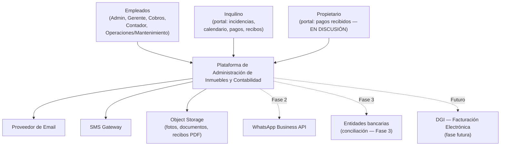
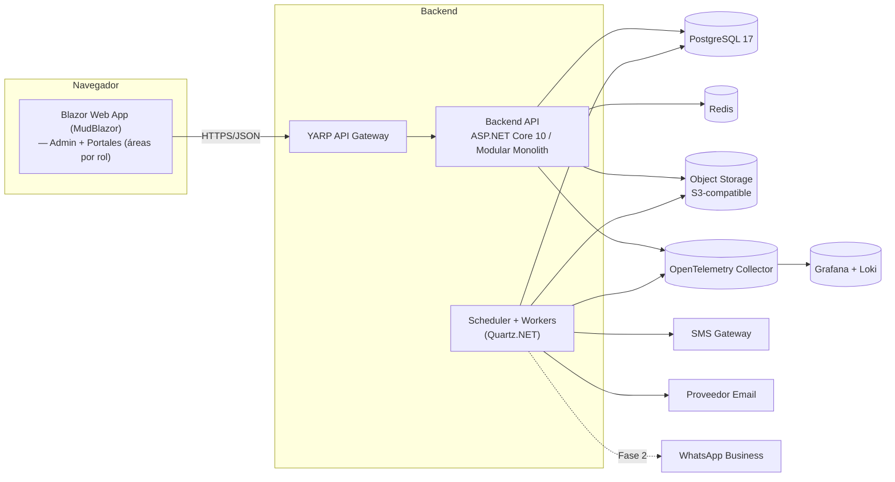
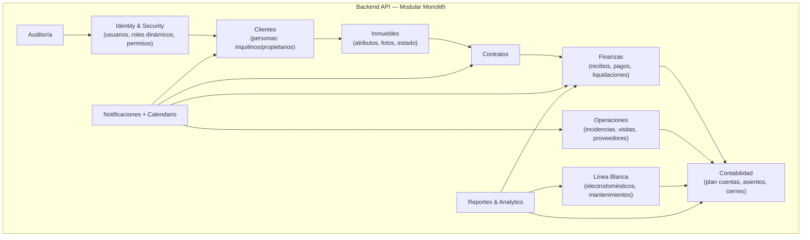
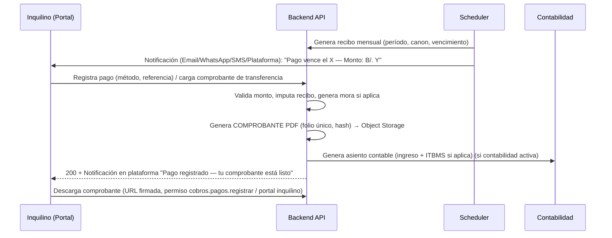

# Diseño de Arquitectura

## Plataforma de Administración de Inmuebles, Portales y Contabilidad (Panamá)

| Campo | Valor |
|---|---|
| **Versión** | 1.3 |
| **Fecha** | 16/09/2026 |
| **Estado** | Borrador de arquitectura v1.3 — v1.2 incorpora permiso `clientes.estado.cambiar`, reglas de cambio de estado gestionado (RN-C5/R-C6) y exclusividad de ocupación reforzada (RN-I1, defensa en profundidad). **v1.3:** carga de contrato firmado obligatorio en arrendamiento (RN-CT7, URL firmada, pestaña Documentos) y gestión de documentos en ficha de cliente con `clientes.documentos.gestionar` asignado a Gerente y Cobros/Finanzas (§7.4). Pendiente de validación con el cliente, asesor legal y contador panameño |
| **Documentos base** | `requerimiento-funcional.md` (v0.2), `levantamiento-requerimientos.md` (v0.1), `modulo-contabilidad.md` (nuevo, v1.0) |
| **Modelo C4** | Sistema → Contenedores → Bounded Contexts → (componentes de alto nivel) |

---

## Cómo leer este documento

- Este documento **reemplaza la v0.2** y refleja el **nuevo alcance** comunicado por el cliente (módulos de clientes, inmuebles enriquecidos, portales con calendario/notificaciones, recibos descargables, línea blanca, contabilidad completa y roles dinámicos creados por el cliente).
- Se **cambia el contexto del país**: operación en **Panamá** (moneda USD/Balboa a la par, marco tributario DGI, protección de datos según Ley 81 de 2019). Los documentos anteriores tenían contexto Perú y quedan **obsoletos en su marco legal/fiscal**, aunque sus flujos de negocio se preservan y se adaptan.
- Las decisiones técnicas están en la sección **ADRs (sección 22)** con alternativas y criterios de escape.
- Lo pendiente de confirmación aparece marcado como `(SUPUESTO PA-###)` y se resume en la **[Matriz de supuestos](#matriz-de-supuestos-pa-###)**.

---

## 1. Objetivo y alcance de la arquitectura

La plataforma debe soportar, de extremo a extremo, el modelo de negocio de **administración de inmuebles y alquileres** de una empresa panameña:

1. **Módulo de Clientes**: registrar a los clientes — **inquilinos** y **propietarios (dueños) de inmuebles** — con información general completa (nombre, apellido, cédula, contacto, email, lugar de trabajo y toda información relevante), e identificar el rol de cada persona (inquilino alquilando, propietario, o ambos).
2. **Módulo de Inmuebles**: registrar el portafolio de inmuebles con atributos enriquecidos (metros, habitaciones, baños, estacionamientos y cantidad, pisos, amueblado, servicios, etc.) y **fotografías**.
3. **Portal del Inquilino** (login y dashboard propio):
   - Reportar **incidencias** con el apartamento.
   - **Calendario** con eventos y **notificaciones** por **Email, WhatsApp, SMS y Plataforma**: visita de mantenimiento, fecha de pago de alquiler, monto a pagar.
   - Al registrar el pago, el sistema genera un **comprobante descargable** desde su vista.
4. **Portal del Propietario** *(EN DISCUSIÓN)*: ver cuándo se le realizan los pagos y por cuánto monto.
5. **Módulo de Línea Blanca / Electrodomésticos**: catálogo de equipos (aire acondicionado, nevera, lavadora, etc.), **ubicación por inmueble** e **historial de mantenimientos por equipo** (cuántas veces, costo, proveedor).
6. **Módulo de Contabilidad completo** para la empresa, conforme a la **normativa panameña**, con:
   - Plan de cuentas, partida doble, asientos, conciliación bancaria, activos fijos y depreciación, impuestos (ISR, ITBMS, retenciones).
   - **Cierres contables parametrizables**: diario, semanal, mensual, trimestral, bimestral, semestral y anual — configurables por el cliente.
   - Detalle completo en **`modulo-contabilidad.md`**.
7. **Roles y permisos**: **el cliente crea y gestiona sus propios roles**; el **catálogo de permisos lo define el equipo de desarrollo** y se siembra en la base (no editable por el cliente).

**Principios rectores:**

1. **El dinero es transaccional** — toda operación financiera y contable es ACID, inmutable y auditable.
2. **Modelo de dominio primero** — la arquitectura sirve a los bounded contexts de negocio.
3. **Modularidad con soberanía de datos** — cada módulo es dueño de sus tablas; las integraciones entre módulos son explícitas (in-process) y transaccionales cuando es necesario.
4. **Flexibilidad ante lo que aún no se sabe** — proveedores de email/WhatsApp/SMS/pagos/bancos se aíslan detrás de interfaces.
5. **Seguridad desde el diseño** — autorización siempre en backend; el frontend solo controla UX.
6. **Roles dinámicos, permisos fijos** — el cliente compone roles a partir del catálogo de permisos sembrado.

---

## 2. Contexto del sistema (C4 — Nivel 1)



| Sistema externo | Fase | Abstracción |
|---|---|---|
| Proveedor de correo | 1 | `INotificationChannel` |
| SMS Gateway | 2 | `INotificationChannel` |
| WhatsApp Business API | 2 | `INotificationChannel` |
| Object Storage (S3-compatible) | 1 | `IObjectStorage` |
| Conciliación bancaria | 3 | `IBankStatementParser` |
| Facturación electrónica DGI | Futuro | `IInvoiceProvider` |

> `(SUPUESTO PA-###)` — confirmar proveedores antes de implementar cada abstracción.

---

## 3. Arquitectura de contenedores (C4 — Nivel 2)



| Contenedor | Responsabilidad | Criterio |
|---|---|---|
| **Blazor Web App (MudBlazor)** | UI única: área de administración (empleados), área del inquilino y área del propietario. Autenticación por sesión (patrón BFF, cookie httpOnly) | Un solo frontend, menor coste de mantenimiento; el SEO público no es requisito del alcance actual |
| **YARP Gateway** | Routing, rate limiting, correlación de trazabilidad, seguridad de headers, CORS, límites de tamaño | Gateway liviano; no contiene reglas de negocio |
| **Backend API (Monolito Modular)** | Toda la lógica de negocio y reglas; expone API REST por módulo | Un solo proceso desplegable; límites de módulos en código y BD |
| **Scheduler + Workers** | Generación de recibos, notificaciones de pago/visita, eventos de calendario, cierres contables parametrizables, historial de mantenimiento preventivo | Procesos diferibles que no bloquean la API |
| **PostgreSQL 17** | Persistencia transaccional del modelo de dominio | ACID, JSONB para atributos flexibles, sin licencia |
| **Redis** | Caché de lectura (catálogos, configuración, permisos con invalidación), rate limiting, locks de proceso, sesiones de tasa | Reduce carga en BD; nunca dinero en caché |
| **Object Storage (S3-compatible)** | Fotos de inmuebles, fotos/expedientes de clientes, documentos, recibos PDF, respaldos | Binarios fuera de la BD; URLs firmadas con expiración |
| **OpenTelemetry Collector → Grafana/Loki** | Trazas, métricas y logs estructurados centralizados | Observabilidad de extremo a extremo |

**Racional de usar un Monolito Modular (no microservicios):**
- Volumen bajo y concentrado (picos de fin/inicio de mes; cierres contables).
- Un equipo pequeño, un despliegue.
- Las reglas de negocio financiero/contable requieren **transacciones atómicas entre módulos vecinos** (pago → recibo → asiento contable); esto es natural en un monolith y doloroso en microservicios.
- Se definen **bounded contexts con tablas propias** para poder extraer servicios si el negocio crece (ADR-001).

---

## 4. Descomposición por bounded context (módulos)



### 4.1 Esquemas de base de datos por módulo (soberanía de datos)

| Módulo | Esquema | Tablas principales |
|---|---|---|
| Identity | `identity` | `User`, `Role`, `Permission`, `RolePermission`, `UserRole`, `Session`, `RefreshToken` |
| Clientes | `crm` | `Persona`, `PersonaContacto`, `PersonaDireccion`, `Empleo`, `PersonaDocumento`, `CuentaBancaria`, `Consentimiento`, `ClasificacionCliente` |
| Inmuebles | `properties` | `Inmueble`, `InmuebleAtributo(JSONB)`, `InmuebleFoto`, `InmuebleDocumento`, `InmuebleServicio`, `InmueblePropietario`, `InmuebleHistorial` |
| Contratos | `contracts` | `ContratoAdministracion`, `ContratoArrendamiento`, `Clausula`, `Renovacion`, `Inspeccion`, `Garantia` |
| Finanzas | `finances` | `Recibo`, `Pago`, `ReciboArchivo(PDF)`, `NotaAjuste`, `Liquidacion`, `LiquidacionDetalle`, `PagoPropietario` |
| Operaciones | `ops` | `Incidencia`, `IncidenciaSeguimiento`, `IncidenciaArchivo`, `VisitaProgramada`, `Proveedor` |
| Línea Blanca | `assets` | `Electrodomestico`, `CategoriaElectrodomestico`, `ElectrodomesticoMantenimiento`, `ElectrodomesticoArchivo` |
| Contabilidad | `accounting` | `PlanCuenta`, `Asiento`, `AsientoDetalle`, `PeriodoContable`, `TipoCierre`, `CierreEjecutado`, `ConciliacionBancaria`, `ActivoFijo`, `Depreciacion`, `Impuesto`, `Retencion` (detalle en `modulo-contabilidad.md`) |
| Notificaciones | `notifications` | `Notificacion`, `IntentoNotificacion`, `PlantillaNotificacion`, `PreferenciaNotificacion`, `EventoAgendado` |
| Reportes | `reports` | Vistas materializadas / tablas de reporting |
| Auditoría | `audit` | `AuditLog` |

**Regla de soberanía:** ningún módulo consulta tablas de otro directamente; se accede mediante servicios de aplicación del módulo propietario (in-process). Las transacciones multi-módulo las lidera el módulo responsable de la operación (ADR-008).

---

## 5. Estrategia de datos

| Decisión | Elección | Justificación |
|---|---|---|
| **Manejo de dinero** | Montos como **enteros en centavos** (`BIGINT`), conversión en presentación | Evita errores de redondeo; moneda base **USD** (Balboa a la par) `(SUPUESTO PA-###)` |
| **Identidad de personas** | `Persona` única con clasificación derivada de relaciones (inquilino/propietario) + etiqueta opcional en el registro | Una persona puede ser inquilino de un inmueble y propietario de otro |
| **Cédula** | Campo único por documento; **cifrado en reposo** | Documento de identidad panameño (cédula/pasaporte/RUC persona natural) `(SUPUESTO PA-###)` |
| **Atributos flexibles de inmueble** | `JSONB` para datos específicos por tipo (casa, apartamento, local comercial) | Nuevos atributos sin migraciones por cada tipo |
| **Fotos/documentos** | Binarios en Object Storage; referencia + hash en BD | Volumen alto de fotos; entrega por URLs firmadas |
| **Fechas** | Todas en **UTC**; presentación en `America/Panama` | Evita inconsistencias en cierres y vencimientos |
| **Concurrencia financiera** | **Optimistic concurrency** (`rowversion`) en recibos, pagos, liquidaciones y asientos | Evita ediciones simultáneas que corrompan saldos |
| **Borrado** | **Soft delete** en entidades maestras; **inmutabilidad** en finanzas y contabilidad | Cumplimiento y trazabilidad |
| **IDs** | `UUID v7` en tablas distribuidas; enteros internos cuando aplique | Sin colisiones si se migra a servicios |
| **Integridad montos** | `CHECK` `Monto >= 0`, unicidad por `(ReciboId, Periodo)`, en contabilidad `CHECK` sumas Débito = Crédito | Red de seguridad a nivel de BD |
| **Retención documental** | Política configurable; **base propuesta 10 años** para registros contables/fiscales `(SUPUESTO PA-###)` | Definir con CPA/abogado panameño |

---

## 6. Seguridad en la arquitectura

### 6.1 Autenticación y autorización
```mermaid
sequenceDiagram
    participant B as Navegador (Blazor/MudBlazor)
    participant GW as YARP Gateway
    participant API as Backend API
    participant DB as PostgreSQL

    B->>GW: POST /api/auth/login (correo, contraseña)
    GW->>API: reenvía
    API->>DB: Validar credencial (hash, rate-limit, lockout)
    API-->>GW: Access token JWT (15 min, httpOnly, SameSite=Lax)
    Note over B,API: Patrón BFF: el navegador nunca ve el JWT; el token vive en cookie httpOnly<br/>Refresh token rotativo, revocable, en BD
    B->>GW: GET /api/... (cookie)
    GW->>API: valida JWT (firma, issuer, aud, exp) + policy RBAC + permisos
    API->>DB: Consulta con filtros de autorización (no confiar en el cliente)
    API-->>B: 200 Datos autorizados
```

- **Access token**: JWT corto (15 min) en cookie `httpOnly` + `SameSite=Lax`; **Refresh token** rotativo almacenado en BD, revocable.
- **Autorización**: RBAC con **roles dinámicos creados por el cliente** y **catálogo de permisos definido en desarrollo** (sección 7).
- **Recursos de portales**: inquilino/propietario acceden solo a sus propios datos (recurso derivado de su relación, no de roles globales).
- **IDOR**: cada query sobre recurso (inmueble, contrato, recibo, electrodoméstico, asiento) exige verificación de acceso.
- **Validación en backend siempre**; el frontend solo controla UX.

### 6.2 Protección de datos personales (Ley 81 de 2019 — Panamá)
- **Cifrado en reposo** de: cédula/documento, números de cuentas bancarias.
- **Consentimientos** registrados con fecha y versión del aviso, conforme al régimen de la Ley 81 de 2019 y su reglamento.
- Cumplimiento de derechos del titular (acceso, rectificación, cancelación, oposición) en el ADR de datos personales.
- **Logs sin datos sensibles**.

### 6.3 Hardening
- CORS restringido a orígenes conocidos; `Security-Headers` (CSP, HSTS, nosniff); rate limiting por IP/usuario en login y endpoints sensibles.
- No subida libre de archivos: validación de tipo/MIME/tamaño/content; almacenamiento fuera del web root; escaneo antivirus en storage (según proveedor).
- Secretos en gestor de secretos; nunca en código/commits; claves HMAC jamás en frontend.
- **CSRF**: mitigado por cookie `SameSite=Lax` + antiforgery en operaciones state-changing.

---

## 7. Roles y permisos (requisito central del cliente)

### 7.1 Modelo

- **Permisos**: catálogo **fijo definido por el equipo de desarrollo**, sembrado en BD con código estable (ej. `clientes.read`). El cliente **no los edita ni los crea**.
- **Roles**: **los crea y gestiona el cliente** desde el módulo de administración (nombre, descripción, permisos asignados). Se siembran **roles por defecto** que el cliente puede clonar/adaptar.

### 7.2 Catálogo de permisos de ejemplo (por módulo)

| Módulo | Permisos (código) |
|---|---|
| Clientes | `clientes.read`, `clientes.create`, `clientes.update`, `clientes.delete`, `clientes.estado.cambiar`, `clientes.documentos.gestionar` |
| Inmuebles | `inmuebles.read`, `inmuebles.create`, `inmuebles.update`, `inmuebles.delete`, `inmuebles.fotos.gestionar` |
| Contratos | `contratos.read`, `contratos.create`, `contratos.firmar`, `contratos.renovar`, `contratos.terminar` |
| Cobros | `cobros.recibos.generar`, `cobros.pagos.registrar`, `cobros.pagos.anular`, `cobros.mora.consultar` |
| Liquidaciones | `liquidaciones.generar`, `liquidaciones.confirmar`, `liquidaciones.pagar` |
| Incidencias | `incidencias.leer`, `incidencias.asignar`, `incidencias.cerrar`, `incidencias.visitas.programar` |
| Línea Blanca | `lineablanca.registrar`, `lineablanca.mantenimientos.registrar`, `lineablanca.reportes.ver` |
| Notificaciones | `notificaciones.enviar`, `notificaciones.plantillas.editar`, `notificaciones.calendario.gestionar` |
| Contabilidad | `contabilidad.asientos.crear`, `contabilidad.asientos.aprobar`, `contabilidad.plan-cuentas.editar`, `contabilidad.cierres.ejecutar`, `contabilidad.cierres.reabrir`, `contabilidad.estados-financieros.ver`, `contabilidad.conciliacion.ejecutar`, `contabilidad.impuestos.calcular` |
| Administración | `usuarios.gestionar`, `roles.gestionar`, `permisos.consultar`, `configuracion.editar`, `feature-flags.gestionar` |
| Reportes/Auditoría | `reportes.ver`, `auditoria.ver` |

### 7.3 Reglas

- `RN-S01` Todo endpoint protegido evalúa **rol + permiso** evaluado como **policy en backend**.
- `RN-S02` El cliente crea/usuario roles; **no** puede crear permisos ni modificar códigos sembrados.
- `RN-S03` El **Administrador de la plataforma (desarrollo)** gestiona el catálogo de permisos y el acceso de usuarios "super-user" de soporte (limitado y auditado).
- `RN-S04` Los **usuarios de portal** (inquilino/propietario) no son roles RBAC: su alcance es derivado de las relaciones (contrato/inmueble).

### 7.4 Roles por defecto (semilla, clonables)

`Administrador`, `Gerente`, `Contador`, `Cobros/Finanzas`, `Operaciones/Mantenimiento`, `Soporte`, `Solo lectura`.

> Asignación inicial relevante: `clientes.documentos.gestionar` se concede a **Gerente** y **Cobros/Finanzas** en la semilla (además del Administrador, que tiene alcance total). Es un permiso delegable: cualquier rol clonado puede recibirlo.

> Carga de contrato firmado: el adjunto del contrato se sube con `contratos.create`; los documentos de la ficha del cliente con `clientes.documentos.gestionar`. La descarga siempre usa **URL firmada** (patrón de defensa en profundidad RN-S01, ver §10/RN-CT7).

---

## 8. Módulo de Clientes (Personas: Inquilinos y Propietarios)

### 8.1 Funcionalidades
| ID | Requerimiento | Prio |
|---|---|---|
| RF-C1 | Registrar personas con: nombre, apellidos, **cédula** (u otro documento), contacto, email, **lugar de trabajo**, dirección, y campos generales (fecha nacimiento, estado civil, nacionalidad, notas) | A |
| RF-C2 | Clasificar la persona al momento del registro: **Inquilino**, **Propietario**, o **Ambos**; la clasificación también se **deriva automáticamente** de sus relaciones (contratos de arrendamiento, propiedad de inmuebles) | A |
| RF-C3 | Múltiples contactos por persona (teléfono, WhatsApp, correo, emergencia) con etiqueta de preferencia | A |
| RF-C4 | Registrar **información laboral**: empresa, puesto, ingresos (opcional), antigüedad, dirección del trabajo | A |
| RF-C5 | Cargar documentos del cliente (cédula, contrato laboral, referencias, avales) en Object Storage | A |
| RF-C6 | Registrar **cuentas bancarias** del propietario para pagos | A |
| RF-C7 | Consentimiento de datos personales (Ley 81/2019) por persona, con fecha y versión | A |
| RF-C8 | Un propietario puede tener **múltiples inmuebles**; un inmueble puede tener **varios propietarios** con participación % | A |
| RF-C9 | Historial de relaciones por persona (inmuebles, contratos, incidencias, pagos) | M |

### 8.2 Reglas
- `RN-C1` La cédula/documento es **única** y se normaliza antes de validar duplicados.
- `RN-C2` Un inquilino puede tener **un solo contrato activo por inmueble**; en el mismo período no ocupa dos inmuebles.
- `RN-C3` La suma de porcentajes de propiedad de un inmueble **debe ser 100%**.
- `RN-C4` Los datos financieros personales (ingresos) solo se muestran a roles con `clientes.read` financiero (permiso específico a definir).
- `RN-C5` **Cambio de estado gestionado** (`Activo ↔ Inactivo`) requiere `clientes.estado.cambiar`; `Mora` es **derivado** (se recalcula desde cobros) y jamás se edita manualmente.
- `RN-C6` **Desactivación con candados**: no se permite `Activo → Inactivo` si el cliente tiene contratos activos con recibos por cobrar o recibos pendientes (`Emitido`/`En mora`); se evalúa en backend (defensa en profundidad, RN-S01) y se muestra error explícito en UI.

---

## 9. Módulo de Inmuebles

| ID | Requerimiento | Prio |
|---|---|---|
| RF-I1 | Catálogo de inmuebles con **tipo** configurable (Apartamento, Casa, Local comercial, Oficina, Otro) | A |
| RF-I2 | Datos generales: nombre de referencia, dirección, georreferenciación, **área construida m², área de terreno m²**, antigüedad, descripción | A |
| RF-I3 | Atributos enriquecidos: **habitaciones, baños, medio baño, estacionamientos y cantidad**, pisos/niveles, amueblado (sí/no/parcial), servicios incluidos, estado general | A |
| RF-I4 | Atributos específicos por tipo vía JSONB (ej. comercio: local con mezzanine) | A |
| RF-I5 | **Fotografías múltiples** (orden, imagen principal, tipo: fachada, recámaras, cocina, baños, estacionamiento, planos) con miniaturas | A |
| RF-I6 | Documentos/polizas del inmueble (planos, política de seguro) | A |
| RF-I7 | Ciclo de vida: `Disponible`, `En proceso`, `Alquilado/Ocupado`, `En mantenimiento`, `Suspendido`, `Pendiente de entrega` | A |
| RF-I8 | Búsqueda y filtros por tipo, ubicación, habitaciones, baños, estacionamiento, rango de canon, estado | A |
| RF-I9 | Historial del inmueble (contratos anteriores, incidencias, inspecciones) | M |

**Reglas:** `RN-I1` un inmueble **Alquilado/Ocupado** no acepta nuevo contrato activo (exclusividad de ocupación: solo `Disponible`/`Reservado` son candidatos — validado en selector frontend y **re-validado en backend** al guardar, RN-S01); `RN-I2` la ficha no expone datos personales de propietarios; `RN-I3` cambios de estado con fecha efectiva y observación.

---

## 10. Módulo de Contratos (tienda de verdad del negocio)

Se mantiene el diseño funcional previo adaptado a Panamá:

| ID | Requerimiento | Prio |
|---|---|---|
| RF-CT1 | **Contrato de Administración** (empresa ↔ propietario): plantilla, comisión, cargos, duración | A |
| RF-CT2 | **Contrato de Arrendamiento** (empresa ↔ inquilino): canon, moneda (USD), fecha inicio/fin, día de pago, garantía, reajuste, cláusulas | A |
| RF-CT3 | Los **parámetros económicos se guardan en el contrato (snapshot)** para que cambios futuros no alteren liquidaciones históricas | A |
| RF-CT4 | Garantía (meses, monto, depósito), **inspección de entrada/salida** con checklist y fotos | A |
| RF-CT5 | Estados y renovación con aviso anticipado y reajuste configurable (negociado/índice) | A |
| RF-CT6 | Terminación, devolución de garantía, liquidación final | A |

> `(SUPUESTO PA-###)` — el marco legal panameño de arrendamiento (Código Civil y legislación de inquilinato vigente, plazos de aviso, límites de reajuste) debe validarse con asesoría legal antes de fijar reglas de contrato.

**Regla transversal de creación:** `RN-CT7` al crear un contrato el backend valida: (a) el cliente está `Activo` (un `Inactivo` no contrata), (b) el inmueble es candidato (`Disponible`/`Reservado`, no `Alquilado` u ocupado con contrato vigente) y (c) **en Arrendamiento el contrato firmado es obligatorio** (RF-CON-07: PDF/JPG/PNG ≤10 MB; sin adjunto el backend rechaza con `422`, independiente del asistente del frontend) — re-validación en el momento de guardar, defensa en profundidad (RN-S01). El adjunto se almacena en Object Storage y se sirve con **URL firmada**; nunca en el webroot ni expuesto al cliente. El alta de un contrato arrendamiento transiciona el inmueble a `Alquilado` y el alta de administración no ocupa la unidad.

---

## 11. Cobros, pagos y recibos descargables

### 11.1 Flujo


### 11.2 Reglas
- `RN-F1` Cada contrato activo genera **un recibo mensual** (o según periodicidad del contrato) con fecha de vencimiento.
- `RN-F2` **Al registrar el pago** se genera automáticamente el **comprobante PDF** con folio secuencial, monto, período, datos del inmueble y hash de integridad; solo es descargable por el inquilino del contrato o rol con permiso correspondiente.
- `RN-F3` El comprobante es **inmutable**: se regenera como nueva versión si hubiese ajuste, nunca se reescribe.
- `RN-F4` Pagos parciales y aplicación a períodos específicos soportados; el recibo marca `Pagado` al saldar.
- `RN-F5` Días de gracia e interés moratorio **parametrizables** (`(SUPUESTO PA-###)`).

---

## 12. Operaciones: incidencias, visitas y proveedores

| ID | Requerimiento | Prio |
|---|---|---|
| RF-O1 | El **inquilino** reporta incidencia desde el portal (tipo, urgencia, descripción, fotos) vinculada al inmueble/apartamento | A |
| RF-O2 | Workflow: reporte → evaluación → asignación → presupuesto → aprobación → ejecución → cierre | A |
| RF-O3 | **Programación de visita de mantenimiento** (fecha/hora, técnico/proveedor) que dispara **evento de calendario** y notificaciones por los canales del inquilino | A |
| RF-O4 | Catálogo de **proveedores/técnicos** | A |
| RF-O5 | Costo de la incidencia vinculable al contrato/liquidación y a contabilidad | A |
| RF-O6 | Historial de incidencias por inmueble | A |

---

## 13. Notificaciones y calendario (Email, WhatsApp, SMS, Plataforma)

### 13.1 Modelo
- Eventos de negocio: vencimiento de pago (con monto y fecha), visita de mantenimiento (fecha/hora/técnico), pago registrado (comprobante disponible), incidencia (estados), contrato por vencer, cierre contable (interno).
- **Cuatro canales**: `Plataforma` (bandeja en portal), `Email`, `SMS`, `WhatsApp` — cada canal con precondiciones (N° teléfono, consentimiento) y proveedor abstraído (`INotificationChannel`).
- **Preferencias por persona y evento** (ej. "avisos de pago por Email y WhatsApp; visita por SMS y Plataforma").
- **Plantillas** configurables por evento y canal (con variables tipadas).

### 13.2 Reglas
- `RN-N1` Las notificaciones de tipo **vencimiento de pago** se programan N días antes configurable (por defecto: 3, 1, y el día del vencimiento).
- `RN-N2` Las notificaciones de **visita de mantenimiento** se envían al programar la visita y un recordatorio 24 h antes.
- `RN-N3` Cada envío registra **intento, canal, estado y errores**; reintentos con backoff; jamás reintentar envíos no idempotentes sin deduplicación.
- `RN-N4` El **calendario del inquilino** agrega: pagos pendientes (monto/fecha), visitas de mantenimiento, y eventos de contrato.
- `RN-N5` **Nunca se registran** secretos ni datos sensibles en el cuerpo de logs; las plantillas pueden incluir datos personales (con consentimiento).

---

## 14. Módulo Línea Blanca / Electrodomésticos

| ID | Requerimiento | Prio |
|---|---|---|
| RF-B1 | Catálogo de categorías: **Aire acondicionado, Nevera/Refrigerador, Lavadora, Secadora, Cocina/Horno, Microondas, Calentador, Televisor, Otro** | A |
| RF-B2 | Registrar cada **electrodoméstico**: marca, modelo, serie, fecha/costo de compra, proveedor, garantía, estado (`Instalado`, `En reparación`, `De baja`), **inmueble y ubicación exacta** (cocina, lavandería, sala, habitación) | A |
| RF-B3 | **Historial de mantenimientos por equipo**: fecha, tipo (preventivo/correctivo), descripción, costo, proveedor, resultado, próxima fecha sugerida | A |
| RF-B4 | **Reporte por electrodoméstico**: número de mantenimientos, costo acumulado, último/próximo mantenimiento | A |
| RF-B5 | Fotos y documentos (factura de compra, manual) por equipo | M |
| RF-B6 | Integración opcional con contabilidad: **activo fijo y depreciación**, y con incidencias (mantenimientos) | M |
| RF-B7 | Notificación proactiva cuando un equipo se acerca a su mantenimiento preventivo programado | M |

**Reglas:** `RN-B1` un mantenimiento no registrado no afecta el conteo; `RN-B2` el costo del mantenimiento del electrodoméstico en un inmueble alquilado se asigna según reglas del contrato (propietario/inquilino/empresa) — configurable.

---

## 15. Módulo de Contabilidad (resumen)

> ⚠️ **Documento dedicado completo: `docs/modulo-contabilidad.md`.**

Resumen arquitectónico:

- **Esquema propio `accounting`**; soberanía de datos contable; solo el módulo de Contabilidad escribe asientos.
- **Plan de cuentas** parametrizable, versionado.
- **Asientos de partida doble** con numeración, aprobación, inmutabilidad; suma débitos = créditos a nivel de BD.
- **Integración automática** con el negocio: pago de alquiler → asiento de ingreso; liquidación a propietario → gasto/cuenta por pagar; gastos de mantenimiento; compra y depreciación de línea blanca; impuestos.
- **Cierres contables parametrizables**: diario, semanal, mensual, trimestral, bimestral, semestral, anual — la empresa configura periodicidad, día de corte, procesos incluidos (ajustes, estados financieros, impuestos) y bloqueo de períodos.
- **Marco panameño**: Código de Comercio (libros), NIIF/NIIF PYMES, DGI (ISR 25% personas jurídicas, ITBMS 7%, retenciones, dividendos, anticipos), Ley 81/2019 — toda tasa/regla **parametrizada** y validada con CPA.

---

## 16. Portales y experiencia de usuario

### 16.1 Áreas
| Área | Usuarios | Funcionalidad clave |
|---|---|---|
| **Admin** `/app/*` | Empleados (por rol/permiso) | Personas, inmuebles, contratos, cobros, incidencias, línea blanca, contabilidad, notificaciones, reportes, administración (roles/permisos) |
| **Portal Inquilino** `/portal/inquilino/*` | Inquilinos activos | Dashboard, **calendario** (pagos y visitas), **notificaciones**, **reportar incidencia**, pagos y **comprobantes descargables**, datos de contacto |
| **Portal Propietario** `/portal/propietario/*` *(EN DISCUSIÓN)* | Propietarios | Ver **pagos recibidos** (fecha y monto), liquidaciones, comprobantes `(SUPUESTO PA-###)` |

### 16.2 Principios de frontend (Blazor + MudBlazor)
- Componentes pequeños y reutilizables; separación de presentación y lógica (feature folders).
- Loadding/empty/error states consistentes; manejo de 400/401/403/404/409/429/500 con mensajes claros.
- **Permisos de rol** controlan visibilidad de menús/acciones (UX); **backend siempre valida**.
- Accesibilidad y responsive (móvil primero para portales externos).
- Registro de no se guarda lógica de negocio crítica en componentes.

---

## 17. API design y gateway

- REST versionado (`/api/v1/{módulo}/*`), JSON, errores en **RFC 7807 (Problem Details)**.
- Paginación/filtros/orden consistente; DTOs de proyección (no entidades).
- **YARP** provee: routing, rate limiting, correlación (`X-Correlation-Id`), CORS, tamaño de request, logs de acceso.
- Health checks: `/health/live` y `/health/ready` (ready valida PostgreSQL, Redis, Storage).
- Pull de datos de leitura: nada de binarios por la API (URLs firmadas de Object Storage).

---

## 18. Feature flags

| Feature | Flag |
|---|---|
| Portal Propietario (en discusión) | `features.portal-propietario` |
| WhatsApp | `features.notificaciones.whatsapp` |
| SMS | `features.notificaciones.sms` |
| Portal Inquilino (incidencias) | `features.incidencias` |
| Línea Blanca | `features.linea-blanca` |
| Contabilidad completa | `features.contabilidad` |
| Conciliación bancaria | `features.conciliacion` |

Regla: **un feature flag del frontend solo controla UX; el backend valida flag + autorización + regla de negocio.**

---

## 19. Observabilidad

- **OpenTelemetry** (traces, métricas, logs) → Collector → **Grafana + Loki**.
- Métricas: request rate, error rate, latencia p95/p99, disponibilidad, latencia BD/cache/storage, cola del scheduler, cierres contables (duración/errores), envíos de notificación por canal.
- Logs estructurados con `trace_id`, `span_id`, `service`, `user_id` cuando aplique. **Sin datos sensibles**.
- **Auditoría** (esquema `audit`): acciones críticas (login, pagos, liquidaciones, asientos, cierres, roles, config, feature flags) con `TraceId` persistido para cruzar con trazas.
- Alertas: disponibilidad < 99.5%, p95, 5xx, notificaciones fallidas en masa, cierres atascados.

---

## 20. Estrategia de despliegue y operación

- Entornos `dev`, `staging`, `prod`; CI/CD (GitHub Actions): build → tests → análisis → imágenes Docker → despliegue.
- Orquestación **Docker Compose** (inicial) / plataforma gestionada; Kubernetes solo si escala `(SUPUESTO PA-###)`.
- **Backups PostgreSQL** (pg_dump + WAL/PITR) a Object Storage; RPO ≤ 24 h, RTO ≤ 4 h.
- Migraciones de BD versionadas por pipeline.
- Secretos fuera del repo (gestor de secretos del entorno).

---

## 21. Rendimiento y escala

| Aspecto | Diseño | Objetivo |
|---|---|---|
| Reportes contables/financieros | Vistas materializadas por período en `reports` | < 2 s |
| Ciclo de cierre/cobros | Scheduler (no bloquea API) | Sin degradación en picos |
| Documentos/fotos/recibos | Object Storage + URLs firmadas | Sin carga por la API |
| Escrituras financieras | Transaccionales y concisas | p95 < 500 ms |
| Caché | Solo lectura (catálogos, configuración, permisos con invalidación); **nunca dinero/contabilidad** | reduce carga en BD |

---

## 22. Decisiones de arquitectura (ADRs)

### ADR-001 — Patrón de división: Monolito Modular
- **Decisión**: un despliegue, límites estrictos por módulo (interfaces explícitas, esquemas BD propios, sin acoplamiento transversal).
- **Alternativas**: microservicios (rechazada: transacciones de dinero distribuidas), monolith sin límites (rechazada).
- **Escape**: equipos independientes, escalado/aislamiento regulatorio de un módulo, > umbral de volumen operativo.

### ADR-002 — Backend: ASP.NET Core 10 + EF Core
- **Decisión**: **ASP.NET Core 10 (LTS)** + EF Core sobre PostgreSQL; Clean Architecture por módulo (Domain/Application/Infrastructure); CQRS ligero donde aporte.
- **Alternativa**: NestJS/Node (plan B), Spring Boot (viable, no default).

### ADR-003 — Base de datos: PostgreSQL 17
- **Decisión**: PostgreSQL por confiabilidad transaccional, JSONB, sin licenciamiento.
- **Alternativas**: SQL Server (costoso), MySQL (JSONB más débil).

### ADR-004 — Frontend: Blazor Web App + MudBlazor (reemplaza React SPA/Next.js)
- **Contexto**: el nuevo alcance requiere **panel admin + porlares por rol**; **no hay portal público con SEO** como requisito del cliente.
- **Decisión**: una Blazor Web App (ASP.NET Core 10, SSR + interactividad) con MudBlazor como design system; áreas por rol.
- **Ventajas**: stack C# único, menos piezas que mantener, tipos compartidos DTO ↔ UI, componentes MudBlazor maduros.
- **Alternativa rechazada**: React SPA + Next.js (de v0.2) — viable, asume dos frontends y foco SEO; se mantiene como plan de escape si el cliente exige portal público de captación con SEO.
- **Escape**: si apareciera portal público obligatorio, extraerlo a Next.js contra la misma API.

### ADR-005 — Autenticación: JWT + Refresh rotativo en cookie httpOnly (patrón BFF)
- **Decisión**: access token corto (15 min), refresh rotativo en BD, cookie httpOnly (el navegador nunca ve el JWT). CSRF con SameSite + antiforgery.
- **Alternativa**: tokens en localStorage (rechazada: XSS).

### ADR-006 — Procesos asíncronos: Scheduler embebido (Quartz.NET)
- **Decisión**: scheduler dentro del Backend API para: recibos, avisos y eventos de calendario, cierres contables, mantenimientos preventivos.
- **Escape**: workers separados si el volumen lo requiere.

### ADR-007 — Integraciones externas detrás de interfaces (port-adapter)
- **Decisión**: Email, SMS, WhatsApp, storage, bancos y facturación DGI se acceden solo vía interfaces internas; Fase 1 con stubs/facilidad de cambio.
- **Racional**: proveedores aún no elegidos.

### ADR-008 — Transaccionalidad entre módulos
- **Decisión**: operaciones multi-módulo (pago → recibo → asiento contable) en una transacción del módulo líder (Finanzas), invocando servicios de aplicación; soberanía respetada.
- **Escape**: sagas/compensación si se extraen servicios.

### ADR-009 — Observabilidad de extremo a extremo
- **Decisión**: OpenTelemetry (traces/métricas/logs) → Collector → Grafana/Loki; `TraceId` en Auditoría. Health checks por recurso.

### ADR-010 — Representación monetaria en centavos (BIGINT)
- **Decisión**: montos en enteros de centavos; aritmética de mora con escalamiento; moneda USD (Balboa a la par) con soporte multi-moneda futuro.
- **Alternativa**: `DECIMAL(18,2)` (riesgo de redondeo acumulado en intereses/cierres).

### ADR-011 — Catálogo de permisos fijo + roles dinámicos del cliente
- **Decisión**: dos planos: (1) permisos sembrados por desarrollo, código estable, no editables; (2) roles creados por el cliente componiendo permisos. Políticas RBAC en backend.
- **Racional**: flexibilidad operativa del cliente sin perder coherencia del modelo de autorización.

### ADR-012 — Cierres contables parametrizables
- **Decisión**: el módulo de Contabilidad define `TipoCierre` configurable (diario/semanal/mensual/trimestral/bimestral/semestral/anual o personalizado) con procesos (ajustes, impuestos, estados financieros, bloqueo). Ejecutado por el scheduler con auditoría. Detalle en `modulo-contabilidad.md` (sección 5).

### ADR-013 — Línea blanca como módulo de activos propio (`assets`)
- **Decisión**: catálogo de equipos con ubicación por inmueble e historial de mantenimiento; no se mezcla en `finances`; integra a contabilidad (activo fijo/depreciación) opcionalmente.
- **Racional**: es inventario+mantenimiento, no una cuenta contable directa.

### ADR-014 — Comprobantes/recibos PDF inmutables
- **Decisión**: al registrar pagos se genera comprobante PDF (folio, hash, metadatos en BD, binario en Object Storage); nueva versión ante ajustes, nunca reescritura; descarga por URL firmada.

### ADR-015 — Límites de frontera por módulo (esquema, contrato, soberanía)
- **Decisión**: esquema PostgreSQL propio por módulo (sin FK entre esquemas), Shared Kernel mínimo, comunicación exclusivamente por contrato in-process o eventos; nunca acceso directo a tablas/DbContext ajenos.
- **Racional**: para que un fallo no se propague por dependencia y para que la extracción futura sea mecánica.

### ADR-016 — Contención de fallos en proceso (bulkheads, breakers, jobs aislados, degradación)
- **Decisión**: semáforo de concurrencia por módulo, timeout + circuit breaker por dependencia (interna y externa), `HostedService` por módulo con bandera y captura independiente, degradación declarada en consumidores (no cascada), excepciones → `ProblemDetails` genérico + `traceId`.
- **Racional**: un módulo lento/errando degrada solo a sí mismo y a sus consumidores directos. El aislamiento de proceso completo NO es posible en monolito y queda fuera de alcance (ADR-001/ADR-018).

### ADR-017 — Kill-switch remoto: control plane separado (Ops Console) + estado persistente + fast-fail
- **Decisión**: servicio mínimo **Ops Console** (separado del host) para desactivar/reactivar módulos; estado `module_state:{id}` en **Redis (pub/sub) + DB persistente** (fail-closed al arrancar); `ModuleAvailabilityFilter` → `503` fast-fail por módulo; jobs pausados; widgets del dashboard y menús ocultos por el mismo registro; auditoría de cada acción. Reactivación sin reinicio ni downtime.
- **Racional**: el interruptor no puede vivir dentro de la app que falla; apagar un módulo no elimina permisos (`flag + permiso`, RN-S01).

### ADR-018 — Observabilidad por módulo + evolución mecánica a microservicio
- **Decisión**: logs con label `module` en Loki, métricas por módulo en Prometheus, trazas con `module.name`, health checks por módulo. Extracción a microservicio solo por métrica (p99/CPU/escalado), mecánica porque esquema + contrato + telemetría ya son propios.
- **Racional**: diagnóstico = query de Loki + dashboard de Grafana por módulo; no se extrae por moda, se extrae por medición.

> Detalle completo de ADR-015 a 018 en **`docs/adr-aislamiento-modulos-killswitch.md`**.

---

## 23. Riesgos técnicos

| Riesgo | Impacto | Mitigación |
|---|---|---|
| Marco legal/fiscal panameño mal interpretado (arrendamiento, DGI, libros, retenciones) | No cumplimiento legal | Validar con abogado/CPA panameño antes de implementar módulos legales y contables (bloqueante) |
| Contabilidad: plan de cuentas y reglas del cliente no recopiladas | Rediseño del módulo | Toda regla parametrizada + cuestionario previo (`modulo-contabilidad.md` §16) |
| Proveedores (SMS/WhatsApp/storage) sin elegir | Notificaciones retrasadas | Port-adapter desde Fase 1 |
| Portal propietario "en discusión" | Dependencia de alcance | Diseño preparado; feature flag; sin costo en Fase 1 |
| Cierres mal configurados → asientos erróneos | Descuadres | Cierres con validaciones, bloqueos, reapertura controlada y auditoría |
| Cambio de moneda (dólar vs balboa) | Confusión en reportes | Moneda única interna en centavos USD; formato B/. en presentación |
| Retención de datos personales (Ley 81/2019) | Incumplimiento | Consentimientos, cifrado, derechos del titular |

---

## 24. Matriz de supuestos (PA-###)

> ⚠️ **Pendientes de validación.** Bloqueantes marcados **SÍ**.

| ID | Supuesto | Bloqueante | Impacto |
|---|---|---|---|
| PA-01 | País de operación: **Panamá** (ciudad principal a confirmar) | **SÍ** | Legal, fiscal, fechas, moneda |
| PA-02 | Moneda base **USD** (Balboa a la par); montos en centavos | **SÍ** | Modelo monetario |
| PA-03 | **Stack confirmado**: .NET 10 + Blazor/MudBlazor + YARP + PostgreSQL + Redis | **SÍ** | Scaffolding completo |
| PA-04 | Portal del **propietario** — funcionalidad y alcance en discusión | No | Módulo portal, permisos |
| PA-05 | Documento de identidad: cédula/pasaporte/RUC; normalización a confirmar | SÍ (para cliente) | Modelo de `Persona` |
| PA-06 | Volumen: ~400 inmuebles, ~2,500 pagos/mes, 20–50 concurrentes a 3 años (misma base v0.2) | No | No funcionales |
| PA-07 | Proceso de cobros: días de gracia e interés moratorio a confirmar | No | Reglas de negocio |
| PA-08 | Retención documental: 10 años (base) | No | Cumplimiento/archivo |
| PA-09 | Contabilidad: NIIF vs NIIF PYMES, plan de cuentas, frecuencias de cierre, tasas DGI | **SÍ** | Módulo contable |
| PA-10 | Proveedores de Email y SMS iniciales; WhatsApp Fase 2 | No (Fase 2) | Notificaciones |
| PA-11 | Facturación electrónica DGI en fase futura | No | Comprobantes |
| PA-12 | Orquestación simple (Docker Compose); Kubernetes solo si escala | No | Operación |

---

## 25. Plan de implementación por fases

### Fase 0 — Fundación
Identity + roles dinámicos con catálogo de permisos sembrado, YARP, observabilidad, CI/CD, Docker Compose, health checks.

### Fase 1 — Núcleo del negocio
Clientes (personas), Inmuebles con atributos y fotos, Contratos, Cobros → **recibos descargables**, dashboard inquilino básico (pagos + comprobantes), liquidaciones y pagos a propietario.

### Fase 2 — Operación y comunicación
Incidencias con portal inquilino, **calendario**, **notificaciones multicanal** (Plataforma + Email + SMS; WhatsApp según proveedor), **Línea blanca** con historial de mantenimiento, plantillas de notificación, reportes operativos.

### Fase 3 — Contabilidad completa
Plan de cuentas, asientos automáticos desde el negocio, activos fijos/depreciación, **cierres parametrizables**, impuestos panameños, estados financieros, conciliación bancaria.

### Fase 4 — Extensión
Portal propietario (si se confirma), proveedores reales (SMS/WhatsApp), facturación DGI, multi-moneda/empresa si aplica.

---

## 26. Índice general del repositorio

```
/ (raíz)
├─ docs/
│  ├─ levantamiento-requerimientos.md   (v0.1 — preguntas del cliente)
│  ├─ requerimiento-funcional.md        (v0.2 — requiere actualización al nuevo alcance)
│  ├─ diseno-arquitectura.md            (v1.1 — este documento)
│  ├─ adr-aislamiento-modulos-killswitch.md (v1.0 — ADR-015..018: aislamiento, kill-switch, control plane)
│  └─ modulo-contabilidad.md            (v1.0 — diseño del módulo de contabilidad panameña)
├─ src/
│  ├─ Backend.API/                      (módulos: Identity, CRM, Properties, Contracts, Finances,
│  │                                     Ops, Assets, Accounting, Notifications, Reports, Audit)
│  ├─ Backend.Tests/
│  └─ App/                              (Blazor Web App + MudBlazor: Admin y Portales)
└─ infra/                               (compose, CI/CD, scripts de backup)
```

---

*Documento de arquitectura de referencia v1.0. Las decisiones marcadas como supuestos deben validarse antes de la fase correspondiente; los ADR se mantienen versionados. El módulo de contabilidad se desarrolla en `docs/modulo-contabilidad.md`.*