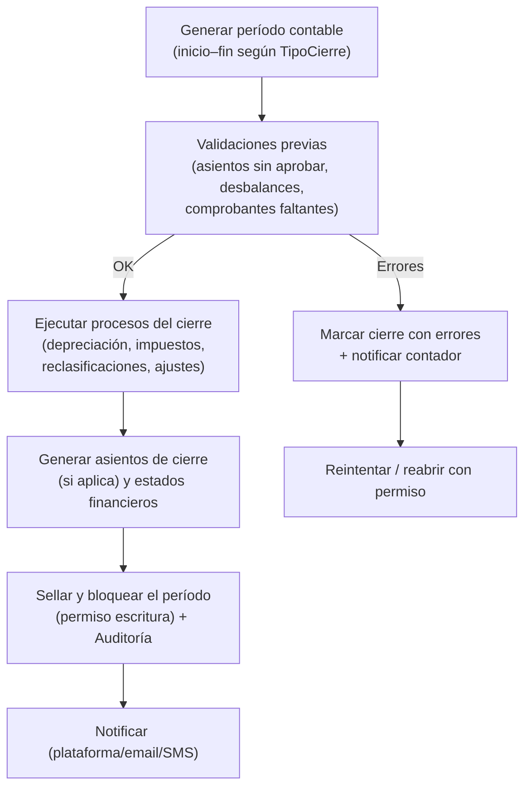
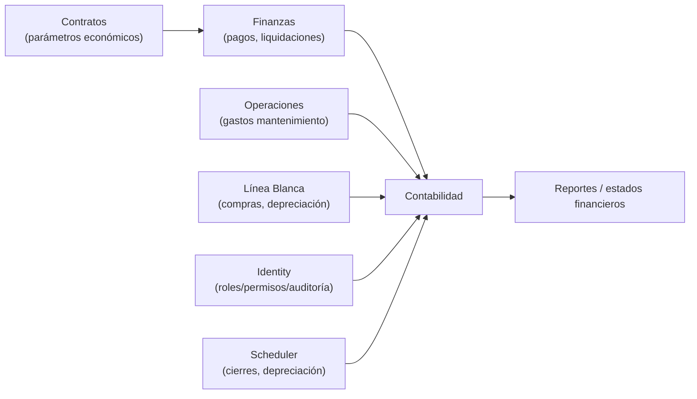

# Módulo de Contabilidad

## Diseño Funcional y Técnico — Contabilidad Empresarial conforme a la normativa panameña

| Campo | Valor |
|---|---|
| **Versión** | 1.0 |
| **Fecha** | 10/09/2026 |
| **Estado** | Documento de diseño del módulo de contabilidad. Marco panameño: **requiere validación con Contador Público Autorizado (CPA) y asesor legal** antes de implementar reglas fiscales |
| **Documento relacionado** | `diseno-arquitectura.md` (v1.0) — sección 15 |
| **Alcance** | Explicar qué lleva un módulo de contabilidad completo, cómo se adapta a las necesidades del cliente y cómo cumple (configurablemente) con las exigencias panameñas, incluidos **cierres parametrizables** (diario, semanal, mensual, trimestral, bimestral, semestral, anual) |

---

## 1. Objetivo y cómo leer este documento

Este documento fue solicitado para explicar **todo lo que implica un módulo de contabilidad** de empresa y **qué se necesita** para adaptarlo a las necesidades de uso del cliente, en el contexto de la **República de Panamá**.

Estructura de contenido:

1. Marco normativo panameño aplicable (resumen y qué debe validarse).
2. Componentes funcionales del módulo (qué lleva).
3. **Cierres contables parametrizables** (requerimiento clave, en detalle).
4. Cómo se alimenta la contabilidad desde el negocio de alquileres.
5. Requerimientos funcionales, reglas de negocio, modelo de datos y permisos.
6. Cuestionario para adaptar el módulo al cliente y lista de validaciones legales.

> ⚠️ **Advertencia de arquitectura:** este documento no sustituye asesoría de un **Contador Público Autorizado (CPA)** panameño ni de un abogado. Todas las tasas, formularios y plazos de la DGI que se mencionan son referenciales y deben **configurarse y validarse** antes de producción.

---

## 2. Marco normativo panameño aplicable

### 2.1 Base normativa que debe contemplar el sistema

| Tema | Obligación general | Estrategia del sistema | Validar con |
|---|---|---|---|
| **Obligación de llevar contabilidad** | Los comerciantes deben llevar contabilidad según el **Código de Comercio** de Panamá | Módulo genera y mantiene libros contables de forma digital y auditable | Asesor legal |
| **Libros obligatorios** | Registro del **libro diario, libro mayor e inventarios** (y su legalización cuando corresponda) | El sistema genera los tres libros como reportes/exportaciones versionadas | CPA |
| **Marco contable / normas** | Aplicación de **NIIF** o **NIIF para PYMES** según el tipo/obligación de la empresa | Plan de cuentas y reportes alineados a NIIF/NIIF PYMES, parametrizables | CPA |
| **Impuesto sobre la Renta (ISR)** | Personas jurídicas: **25%** (tasa general referencial); personas naturales: escala progresiva | Tasa/cálculo parametrizado; reportes de cálculo ISR por período | CPA / DGI |
| **ITBMS** | Impuesto de Transferencia de Bienes Muebles y Servicios: **7%** (referencial) con exenciones según actividad | Catálogo de tasas por tipo de operación + tratamiento de arrendamientos (residencial vs comercial) | CPA |
| **Retenciones** | Retenciones de ITBMS, ISR a terceros, dividendos, honorarios, entre otras | Motor de retenciones parametrizado + comprobantes de retención | CPA |
| **Dividendos** | Impuesto sobre dividendos distribuidos (tasas según origen y residencia) | Cálculo en asiento de distribución de utilidades | CPA |
| **Anticipos** | Pagos fraccionados/anticipados del impuesto | Recordatorios y asientos de anticipo | CPA |
| **Declaraciones DGI** | Declaración de renta anual, ITBMS periódico, retenciones | Reportes de soporte exportables para llenado de formularios DGI | CPA / DGI |
| **Facturación electrónica** | La DGI impulsa la **facturación electrónica** de forma progresiva | Abstracción `IInvoiceProvider`; generación de comprobantes; integración futura | DGI |
| **Timbres / documentos** | Aplicación de timbres fiscales cuando corresponda | Campo configurable por documento | CPA |
| **Retención de documentos** | Los registros contables y fiscales deben conservarse por el plazo legal (base propuesta **10 años**) | Retención/archivo inmutable y política configurable | CPA / asesor legal |
| **Protección de datos** | **Ley 81 de 2019** de Protección de Datos Personales y su reglamento | Cifrado de datos personales, consentimientos, derecho de acceso/rectificación/cancelación/oposición | Asesor legal |
| **Firma del contador** | Los estados financieros de muchas empresas requieren la certificación de un **CPA** | Estados financieros exportables (PDF/Excel) con campos para firma electrónica del CPA | CPA |

### 2.2 Conclusión de marco
El módulo debe ser **parametrizable** en: plan de cuentas, tasas impositivas, periodos fiscales, formatos de reportes y plazos. Así se puede ajustar sin desarrollo a la realidad vigente confirmada por el CPA del cliente.

---

## 3. Componentes funcionales de un módulo de contabilidad completo

### 3.1 Plan de cuentas (catálogo contable)
- Catálogo **jerárquico y configurable** (grupo, subgrupo, cuenta, subcuenta).
- **Versionado**: el catálogo tiene versión y fecha de vigencia; las cuentas se desactivan/migran sin romper asientos históricos.
- Agrupaciones para generar **Balance General** y **Estado de Resultados** (estructura de presentación parametrizable).
- Se sugiere entregar una **semilla basada en un catálogo panameño común (NIIF PYMES)** que el cliente podrá ajustar.
- Atributos por cuenta: naturaleza (deudora/acreedora), tipo (activo, pasivo, patrimonio, ingreso, gasto), centro de costo permitido, cuenta bancaria asociada, impuesto asociado (ITBMS/ISR), estado.

### 3.2 Comprobantes y asientos (partida doble)
- **Asiento / póliza** con: fecha, período contable, descripción, origen (manual o automático desde otro módulo), estado (borrador, por aprobar, aprobado, revertido).
- **Detalle de asiento**: cuenta, centro de costo (opcional), débito, crédito, referencia externa (recibo, pago, liquidación).
- **Integridad**: la sumatoria de débitos debe ser **exactamente igual** a la de créditos (validado a nivel de aplicación y BD).
- **Numeración**: consecutiva por tipo de asiento y período (o folio secuencial global configurable).
- **Flujo de aprobación**: roles con `contabilidad.asientos.crear` y `contabilidad.asientos.aprobar`; un asiento aprobado **no se edita** (se revierte con contra-asiento, dejando trazabilidad).
- **Saldos**: cálculo por cuenta en cualquier corte de fecha; reportes de mayor y auxiliares.

### 3.3 Caja, bancos y conciliación bancaria
- Registro de **caja general**, **caja chica** (fondo fijo/reposición) y **cuentas bancarias** de la empresa.
- Registro de movimientos bancarios (ingresos y egresos) por cuenta.
- **Conciliación bancaria**: lectura de extracto (manual o archivo/banco, Fase 3 vía `IBankStatementParser`), comparación con los movimientos del sistema, diferencias (cheques en tránsito, cargos bancarios, intereses) y asiento automático de ajuste al cuadrar.
- Control: un período conciliado queda "marcado" y bloquea modificaciones salvo reapertura con permiso.

### 3.4 Cuentas por cobrar y por pagar (CxC / CxP)
- Integración con **Finanzas**: recibos de alquiler → CxC de inquilinos; liquidaciones a propietarios y gastos → CxP.
- Estados (documento emitido, parcialmente cobrado/pagado, cobrado/pagado, vencido, anulado).
- Reportes de antigüedad de saldos.
- **Nota:** en el alcance base, la CxC/CxP puede ser solo "de paso" hacia los asientos; se recomienda habilitarla completamente cuando el cliente lo requiera.

### 3.5 Activos fijos y depreciación
- Registro de **activos fijos** (compra de línea blanca, mobiliario, equipo informático) con: fecha, costo, cuenta contable, método de depreciación, vida útil, valor residual.
- **Depreciación**: línea recta (por defecto) u otros métodos, calculada por período en el cierre; genera asiento automático.
- **Integración con Línea Blanca**: un electrodoméstico puede marcarse como activo fijo y depreciarse.
- Bajas/ventas/transferencias de activos con asiento correspondiente.
- Reportes: kárdex de activos, depreciación acumulada, próximas depreciaciones.

### 3.6 Impuestos (motor parametrizable)
- **ITBMS**: tasas por operación; registro de ITBMS cobrado (ventas/arrendamiento cuando aplique) y ITBMS pagado (compras/gastos); saldo a favor o a pagar por período.
- **ISR**: cálculo sobre utilidades del período (estimado y anual); provisión mensual; anticipos.
- **Retenciones**: motor de retención por tipo de tercero y operación; emisión de certificados de retención; reportes para DGI.
- **Dividendos**: cálculo al distribuir utilidades.
- Todo **parametrizado** (tasas, umbrales, plazos) y configurable por el CPA.

### 3.7 Nómina y provisiones
- El módulo **no calcula nómina**: el **motor de nómina vive en Recursos Humanos** (`docs/modulos/recursos-humanos.md` v1.0, esquema `hr`; ADR-022, base RF-RH-001). La planilla **aprobada** en RH genera **asientos borrador** de gastos de personal y CxP (FL-CTB-03) que Contabilidad **aprueba** — separación de funciones (quien crea no aprueba).
- Contabilidad sí soporta **provisión contable de gastos de personal** (salarios, seguro social, décimo tercer mes, vacaciones) mediante asientos manuales y la contabilización de los asientos borrador originados por RH.

### 3.8 Inventario (opcional)
- Si la empresa gestiona insumos (repuestos, materiales de mantenimiento), se puede habilitar inventario simplificado con impacto contable en el cierre.

### 3.9 Cierres contables parametrizables (requerimiento clave)
Ver sección 5 — diseño detallado.

### 3.10 Estados financieros y reportes
Los estados financieros contables principales:

1. **Balance General (Estado de Situación Financiera)** — activos, pasivos, patrimonio al cierre.
2. **Estado de Resultados** — ingresos, costos, gastos, utilidad del período.
3. **Estado de Flujos de Efectivo** — método directo e indirecto (configurable).
4. **Estado de Cambios en el Patrimonio**.
5. **Notas a los Estados Financieros** — generadas parcialmente desde los datos del sistema.

Otros reportes contables:

- Libro Diario y Libro Mayor (por período, exportables).
- Balance de Comprobación (balanza de sumas y saldos).
- Auxiliares por cuenta y por tercero.
- Reportes de impuestos (ITBMS, ISR, retenciones, dividendos).
- Reporte de cierres ejecutados y períodos bloqueados.

### 3.11 Presupuesto y control (opcional, Fase 2+)
- Presupuesto por cuenta/centro de costo vs. ejecutado.

---

## 4. Cómo se alimenta la contabilidad desde el negocio

La clave de un módulo contable útil es que **los eventos del negocio generen asientos automáticamente** (sin doble digitación). El esquema `accounting` recibe eventos del módulo líder y crea asientos con trazabilidad.

| Evento del negocio | Módulo origen | Asiento(s) generado(s) | Cuentas típicas (ejemplo, sujeto a plan de cuentas del cliente) |
|---|---|---|---|
| Pago de alquiler registrado | Finanzas | Banco/Caja (D) ↔ Ingreso por arrendamiento (H) + ITBMS por pagar si aplica | 1110 Banco, 4101 Ingresos por arrendamiento, 2101 ITBMS por pagar |
| Comisión de la empresa devengada | Finanzas | Cuenta por cobrar cliente/comisión (D) ↔ Ingreso por comisiones (H) | 13xx, 41xx |
| Liquidación al propietario | Finanzas | Gasto por administración/comisión (D) ↔ CxP a propietario (H) | 51xx, 21xx |
| Pago al propietario | Finanzas | CxP a propietario (D) ↔ Banco (H) | 21xx, 1110 |
| Gasto de mantenimiento de incidencia | Ops | Gasto de mantenimiento (D) ↔ Banco/CxP (H) | 51xx, 21xx |
| Compra de electrodoméstico | Assets | Activo fijo (D) ↔ Banco/CxP (H) + ITBMS por pagar | 15xx, 1110, 2101 |
| Depreciación de activos | Accounting (cierre) | Gasto por depreciación (D) ↔ Depreciación acumulada (H) | 52xx, 15xx |
| Nómina/provisión | **Recursos Humanos** (planilla aprobada) | Gasto por salarios (D) ↔ Banco/obligaciones (H); horas extras y beneficios; mano de obra directa/indirecta por proyecto/centro de costo; CxP retenciones/CSS/préstamos | 51xx/52xx, 21xx |
| Provisión de impuestos | Accounting (cierre) | Gasto ISR (D) ↔ ISR por pagar (H) | 53xx, 21xx |
| Recaudación de ITBMS | Accounting | Banco (D) ↔ ITBMS por pagar (H) | 1110, 2101 |

**Reglas de integración:**
- `RN-CN1` Los asientos automáticos se generan **dentro de la misma transacción** o inmediatamente después (cola) según criticidad; la integridad del asiento se valida siempre.
- `RN-CN2` Todo asiento automático guarda la **referencia del documento origen** (id + tipo) para trazabilidad.
- `RN-CN3` Si el evento de origen se anula, se genera un **asiento de reversión** (nunca se edita el original).

---

## 5. Cierres contables parametrizables (diseño en detalle)

### 5.1 Concepto
Un **cierre contable** delimita un período (inicio–fin), ejecuta procesos finales (ajustes, provisiones, impuestos, estados financieros) y **bloquea el período** para escrituras. El requisito del cliente exige que **la empresa configure** la frecuencia del cierre:

- Diario
- Semanal
- Mensual
- Trimestral
- Bimestral
- Semestral
- Anual
- (o combinación/personalizado)

### 5.2 Configuración (`TipoCierre`)

| Campo | Ejemplo |
|---|---|
| Nombre | "Cierre Mensual" |
| Periodicidad | Diario / Semanal / Mensual / Bimestral / Trimestral / Semestral / Anual / Personalizado |
| Día de corte | mensual: `día 28`; semanal: `Viernes`; personalizado: `cada 45 días` |
| Mes de inicio del ejercicio | Enero |
| Meses que acumula por cierre | mensual: 1; bimestral: 2; trimestral: 3; semestral: 6; anual: 12 |
| Procesos del cierre | [ ] Validar asientos (cuadre, cuentas obligatorias)<br/>[ ] Depreciación<br/>[ ] Provisión de impuestos<br/>[ ] Reclasificación de cuentas<br/>[ ] Asiento de cierre de resultados (si se usa)<br/>[ ] Generar estados financieros<br/>[ ] Bloquear período<br/>[ ] Notificar a contador |
| Emitir estados financieros | Sí / No |
| Bloqueo automático | Sí (bloquea períodos <= cierre) |
| Ejecución | Automática (scheduler) con hora configurable / Manual |

### 5.3 Flujo de ejecución de un cierre



### 5.4 Reglas de negocio de los cierres

- `RN-CN-1` **No se pueden crear/modificar asientos** en un período `Cerrado`. Excepción: reapertura controlada con permiso `contabilidad.cierres.reabrir`, causa documentada y auditoría.
- `RN-CN-2` Los períodos se generan automáticamente por el scheduler según el `TipoCierre` configurado; cada período tiene estados: `Abierto → EnCierre → Cerrado → Reabierto`.
- `RN-CN-3` El cierre de un período **mayor** (trimestral/anual) solo procede si los períodos menores que lo componen están cerrados (jerarquía de cierres).
- `RN-CN-4` Al cerrar, se registra: usuario, fecha, hora, `TraceId`, resumen de procesos, número de asientos generados, estado.
- `RN-CN-5` Si el cierre automático falla 3 veces, se genera alerta operativa (observabilidad) y queda `EnCierre` para revisión manual.
- `RN-CN-6` Los asientos de **depreciación e impuestos** son idempotentes: si el proceso se re-ejecuta, no duplica valores.

### 5.5 Ejemplos de configuración según el cliente

| Necesidad del cliente | Configuración |
|---|---|
| Control diario de caja | `Cierre Diario`: corte al final del día; bloquea asientos del día siguiente |
| Reporte gerencial semanal | `Cierre Semanal`: corte viernes; genera resultados semanales |
| Cumplimiento mensual típico | `Cierre Mensual`: corte día 28 o último día; genera EF mensual |
| Impuestos trimestrales | `Cierre Trimestral`: acumula 3 meses (enero–marzo…) |
| Dos meses (quincena doble) | `Cierre Bimestral`: corte cada 2 meses |
| Mitad de año | `Cierre Semestral`: 2 cortes al año |
| Cierre de ejercicio | `Cierre Anual`: asientes de cierre de resultados y reapertura el 1° de enero + provisión de impuestos anual |
| Combinación | `Mensual + Anual`: cierres mensuales para operación, anual para fiscal |

---

## 6. Requerimientos funcionales del módulo de contabilidad

| ID | Requerimiento | Prio |
|---|---|---|
| RF-CN01 | Gestión del **plan de cuentas** jerárquico, versionado y configurable | A |
| RF-CN02 | Creación de **asientos** con partida doble, numeración, estados y aprobación | A |
| RF-CN03 | Validación automática de **débitos = créditos** y cuentas válidas | A |
| RF-CN04 | **Reversión** de asientos con contra-asiento y trazabilidad | A |
| RF-CN05 | Registro de **caja, bancos y cuentas bancarias** de la empresa | A |
| RF-CN06 | **Conciliación bancaria** manual (Fase 1) y por archivo/banco (Fase 3) | M |
| RF-CN07 | **CxC/CxP** integradas con finanzas | M |
| RF-CN08 | **Activos fijos y depreciación** (integrando Línea Blanca) | M |
| RF-CN09 | Motor de **impuestos**: ITBMS, ISR, retenciones, dividendos — tasas parametrizables | A |
| RF-CN10 | **Cierres parametrizables** (diario/semanal/mensual/trimestral/bimestral/semestral/anual/personalizado) con scheduler, bloqueo y reapertura controlada | A |
| RF-CN11 | Generación de **estados financieros** (Balance, Resultados, Flujo, Patrimonio) por período | A |
| RF-CN12 | Reportes: libro diario, libro mayor, balanza de comprobación, auxiliares, impuestos | A |
| RF-CN13 | Exportación a Excel/PDF de todos los reportes y estados financieros | A |
| RF-CN14 | **Asientos automáticos** desde los eventos del negocio (finanzas, ops, assets) | A |
| RF-CN15 | **Auditoría contable**: quién creó/aprobó/reabrió cada asiento y cierre | A |
| RF-CN16 | **Autorización por permisos**: crear, aprobar, ver, cierre, reapertura | A |
| RF-CN17 | Retención/configuración del **ejercicio fiscal** y formato de fechas | A |

---

## 7. Reglas de negocio contables

| ID | Regla |
|---|---|
| RN-CN01 | El plan de cuentas no puede desactivarse si tiene movimientos (uso de período de vigencia) |
| RN-CN02 | Un asiento solo se aprueba si: montos > 0, débitos=créditos, cuentas activas y dentro de período abierto |
| RN-CN03 | Los asientos aprobados son **inmutables**; las correcciones usan contra-asiento |
| RN-CN04 | Un período `Cerrado` rechaza toda escritura; reapertura exige permiso especial + causa |
| RN-CN05 | Los cierres jerárquicos: no se cierra un período mayor si un menor está abierto |
| RN-CN06 | Los asientos automáticos llevan la referencia del evento origen (tipo + id) |
| RN-CN07 | La depreciación se calcula desde fecha de alta hasta el corte del cierre |
| RN-CN08 | Toda tasa/imposto/plazo es parámetro configurable, no está hardcodeado |
| RN-CN09 | La utilidad de un cierre se calcula sobre la **balanza cerrada** del período |
| RN-CN10 | No se registran datos personales sensibles en asientos/descripciones (referencias por id) |

---

## 8. Modelo de datos conceptual (esquema `accounting`)

```
Empresa(Id, Nombre, RUC, Activo)                      -- futura multi-empresa

PlanCuenta(Id, Version, Codigo, Nombre, Naturaleza[D|H], TipoCuenta,
           GrupoPadreId, Estado, VigenciaDesde, VigenciaHasta)
EstructuraEF(Id, TipoEF[Balance|Resultados|Flujo|Patrimonio], Grupo,
             Orden, CuentaId o Grupo de cuentas, Formula)

CuentaBancaria(Id, EmpresaId, Banco, NumeroCuenta[encr], Moneda, SaldoInicial)

Asiento(Id, EmpresaId, PeriodoId, TipoAsiento, Folio, Fecha, Descripcion,
        Estado[Borrador|PorAprobar|Aprobado|Revertido],
        EsAutomatico, EventoOrigenTipo, EventoOrigenId, CreadoPor, AprobadoPor, TraceId)
AsientoDetalle(Id, AsientoId, CuentaId, CentroCostoId?, Debito, Credito, TerceroId?, Referencia)

Impuesto(Id, Codigo[ITBMS|ISR|Retencion|Dividendos], Tasa, VigenciaDesde, VigenciaHasta, Regla)
Retencion(Id, AsientoId, TerceroId, Tipo, Base, Tasa, Monto, Comprobante)

PeriodoContable(Id, EmpresaId, TipoCierreId, Inicio, Fin,
                Estado[Abierto|EnCierre|Cerrado|Reabierto],
                CerradoFecha, CerradoPor, ReiniciadoPor, CausaReapertura, TraceId)
TipoCierre(Id, EmpresaId, Nombre, Periodicidad, DiaCorte, MesInicioEjercicio,
           MesesPorCierre, Procesos[flags], BloqueoAutomatico, EjecucionAutomatica)
CierreEjecutado(Id, PeriodoId, FechaEjecucion, Usuario, ProcesosEjecutados,
                Resultado[OK|ConErrores], Errores, AsientosGenerados, TraceId)

ConciliacionBancaria(Id, CuentaBancariaId, PeriodoId, SaldoBanco, SaldoSistema,
                     Estado[EnProceso|Conciliada], Movimientos[] parte de tabla movimientos)
MovimientoBanco(Id, CuentaBancariaId, Fecha, Tipo[D|H], Concepto, Monto, Referencia)

ActivoFijo(Id, EmpresaId, Codigo, Nombre, FechaAlta, Costo, CuentaActivoId,
           MetodoDepreciacion, VidaUtilMeses, ValorResidual, Estado)
Depreciacion(Id, ActivoFijoId, PeriodoId, Monto, AsientoId)

AsientoAutomaticoRegla(Id, EventoTipo, CuentasOrigen[], Config)

LibroDiario / LibroMayor / BalanceComprobacion
  → vistas materializadas o consultas según período (no tablas base)
```

**Relaciones clave:**
- `Asiento → PeriodoContable` (un asiento pertenece a un solo período).
- `AsientoDetalle → PlanCuenta` (nunca asiento sin cuenta).
- `TipoCierre → PeriodoContable` (1:N).
- `ActivoFijo → Depreciacion` (1:N) y `Depreciacion → Asiento`.
- Contabilidad **no escribirá** tablas de otros módulos; leerá vía servicios de aplicación.

---

## 9. APIs del módulo (resumen)

| Endpoint (concepto) | Propósito | Permiso |
|---|---|---|
| `POST /api/v1/accounting/plan-cuentas` | Crear/editar cuentas | `contabilidad.plan-cuentas.editar` |
| `GET /api/v1/accounting/plan-cuentas` | Consultar catálogo | `contabilidad.estados-financieros.ver` |
| `POST /api/v1/accounting/asientos` | Crear asiento (manual) | `contabilidad.asientos.crear` |
| `POST /api/v1/accounting/asientos/{id}/aprobar` | Aprobar/revertir | `contabilidad.asientos.aprobar` |
| `GET /api/v1/accounting/asientos` | Consultar asientos y auxiliares | `contabilidad.estados-financieros.ver` |
| `GET/POST /api/v1/accounting/tipos-cierre` | Configurar cierres | `contabilidad.cierres.ejecutar` |
| `POST /api/v1/accounting/cierres/{periodoId}/ejecutar` | Ejecutar cierre | `contabilidad.cierres.ejecutar` |
| `POST /api/v1/accounting/cierres/{periodoId}/reabrir` | Reabrir período | `contabilidad.cierres.reabrir` |
| `GET /api/v1/accounting/estados-financieros/{periodoId}` | Estados financieros | `contabilidad.estados-financieros.ver` |
| `GET /api/v1/accounting/reportes/libro-diario|mayor|balanza` | Reportes | `contabilidad.estados-financieros.ver` |
| `POST /api/v1/accounting/conciliaciones` | Conciliación bancaria | `contabilidad.conciliacion.ejecutar` |
| `POST /api/v1/accounting/impuestos/calcular` | Cálculo de impuestos del período | `contabilidad.impuestos.calcular` |

---

## 10. Roles y permisos del módulo de contabilidad

Roles sugeridos (semilla, clonables):

| Rol semilla | Permisos asumidos |
|---|---|
| **Contador** | Crear/aprobar asientos, plan de cuentas, cierres, estados financieros, conciliación, impuestos |
| **Administrador** | Todos, incluido reabrir períodos |
| **Gerente / Finanzas** | Lectura de estados financieros y reportes |
| **Auditor / Solo lectura** | `contabilidad.estados-financieros.ver`, `reportes.ver`, `auditoria.ver` |

**Permisos del catálogo (definidos en desarrollo):**

- `contabilidad.plan-cuentas.editar`
- `contabilidad.asientos.crear`
- `contabilidad.asientos.aprobar`
- `contabilidad.cierres.ejecutar`
- `contabilidad.cierres.reabrir`
- `contabilidad.estados-financieros.ver`
- `contabilidad.conciliacion.ejecutar`
- `contabilidad.impuestos.calcular`

Regla: **el cliente crea roles combinando estos permisos; no crea permisos**.

---

## 11. Seguridad e integridad contable

- **Inmutabilidad**: asientos aprobados y períodos cerrados no se modifican; correcciones vía reversión.
- **Validez a nivel BD**: `CHECK Sum(debito)=Sum(credito)` por asiento; restricciones de período cerrado.
- **Auditoría** del módulo (esquema `audit`): creación/aprobación/reversión/reapertura y cierres, con `UserId`, `TraceId`, fecha, IP.
- **Cifrado** de cuentas bancarias y datos personales referenciados.
- **Segregación de funciones**: quien crea el asiento no debe ser la única persona con permiso de aprobación (mejora práctica; el cliente configura).
- **Logs**: nunca contraseñas, tokens ni datos sensibles; solo referencias.

---

## 12. Observabilidad del módulo

- Trazas: cada cierre y cada asiento automático lleva `TraceId` persistido.
- Métricas: duración de cierres, tasa de error, conciliaciones pendientes, asientos generados por fuente.
- Logs estructurados por evento contable (sin datos sensibles).
- Alertas: cierre fallido, período abierto vencido, conciliación pendiente > N días, utilidad anómala (± umbral configurable).

---

## 13. Reportes y estados financieros (formato y exportación)

| Reporte | Contenido | Exportación |
|---|---|---|
| **Balance General** | Activos, pasivos, patrimonio | PDF / Excel |
| **Estado de Resultados** | Ingresos, gastos, utilidad | PDF / Excel |
| **Flujo de Efectivo** | Directo/indirecto | PDF / Excel |
| **Cambios en Patrimonio** | Saldos por rubro | PDF / Excel |
| **Libro Diario** | Asientos por período | PDF / Excel |
| **Libro Mayor** | Movimientos por cuenta | PDF / Excel |
| **Balanza de Comprobación** | Sumas y saldos | PDF / Excel |
| **Auxiliares por tercero/cuenta** | Detalle | PDF / Excel |
| **ITBMS, ISR, Retenciones** | Cálculos por período | PDF / Excel / formato DGI |

---

## 14. Integración con el resto de la plataforma



---

## 15. Adaptación a las necesidades del cliente — segundo paso obligatorio

Para que el módulo "se adapte a las necesidades de uso" del cliente, completar este cuestionario con la empresa y su contador:

### 15.1 Contabilidad general
1. ¿La empresa es persona **jurídica** (S.A., SRL) o persona natural empresaria? (afecta ISR)
2. ¿Marco contable: **NIIF plenas** o **NIIF para PYMES**?
3. Plan de cuentas actual: ¿tienen catálogo propio o se parte de la semilla?
4. ¿Usan software contable hoy? ¿Cuál? (para migración/parametrización de cuentas)
5. ¿La contabilidad es interna o la lleva un **despacho/CPA** que recibirá reportes del sistema?
6. ¿Ejercicio fiscal: enero–diciembre u otro?

### 15.2 Cierres
7. ¿Qué **frecuencia de cierre** desea el sistema? Marcar: diario / semanal / mensual / trimestral / bimestral / semestral / anual — y qué día de corte.
8. ¿Qué procesos debe incluir el cierre? (depreciación, impuestos, reclasificación, asiento de cierre, estados financieros)
9. ¿Requiere que el cierre bloquee periodos automáticamente? ¿Quién puede reabrirlos?

### 15.3 Impuestos y DGI
10. Confirmar **tasas** vigentes: ISR, ITBMS, retenciones, dividendos (y plazos de declaración).
11. ¿La empresa está obligada a **facturación electrónica** DGI? ¿Ya factura así hoy?
12. ¿Qué formularios/reportes DGI necesita el sistema para soportar?

### 15.4 Integración con el negocio
13. Confirmar cuentas del plan para: ingresos por arrendamiento, comisiones, CxP a propietarios, mantenimiento, depreciación de línea blanca, impuestos.
14. ¿Pagarán a propietarios con flujo de caja de la empresa o pasan directamente? (afecta cuentas)
15. ¿Necesitan **centros de costos** (por inmueble, por sucursal)?
16. ¿Necesitan **multi-empresa** a futuro?

### 15.5 Archivo y auditoría
17. Plazo de retención de documentos contables (base: 10 años).
18. ¿Quién revisa/firma los estados financieros (CPA)?

---

## 16. Supuestos legales a validar (bloqueantes)

| # | Validación | Con quién | Impacto |
|---|---|---|---|
| 1 | Obligación de llevar contabilidad y **libros oficiales** (Código de Comercio) y cómo digitalizarlos/legalizar | Asesor legal / CPA | Libros y exportaciones |
| 2 | **Tasas y reglas** vigentes (ISR 25% referencial, ITBMS 7%, retenciones, dividendos, anticipos) | CPA | Motor de impuestos |
| 3 | Tratamiento **ITBMS de arrendamientos** (residencial vs comercial) | CPA | Asientos de arrendamiento |
| 4 | **Facturación electrónica DGI** — obligación y proveedores autorizados | DGI / CPA | Comprobantes |
| 5 | **Plazo de retención** de libros, asientos y documentos | CPA / asesor legal | Retención |
| 6 | **Ley 81/2019** — tratamiento de datos personales en reportes contables (cédulas de propietarios, etc.) | Asesor legal | Cifrado/cumplimiento |
| 7 | Certificación de **estados financieros por CPA** — formato requerido | CPA | Exportaciones |
| 8 | Ejercicio fiscal y períodos de declaración | CPA | Cierres |

---

## 17. Riesgos del módulo

| Riesgo | Mitigación |
|---|---|
| Reglas fiscales cambiantes | Todo parametrizable; auditoría de cambios de parámetros |
| Plan de cuentas incorrecto | Semilla validada con CPA + versión propia del cliente |
| Cierres que bloqueen la operación indebidamente | Reapertura con permiso + causa + auditoría; simulación previa |
| Desalineación de cuentas con el balance real de la empresa | Conciliación bancaria + balanza de comprobación visible |
| Doble trabajo (sistema + Excel del contador) | Asientos automáticos, exportaciones y reportes completos |

---

## 18. Fases de implementación del módulo

| Fase | Entregables |
|---|---|
| **A** — Base contable | Plan de cuentas, asientos manuales, períodos, balanza, libro diario/mayor, reportes, permisos |
| **B** — Automatización | Asientos automáticos desde finanzas/ops/assets, integración con recibos/liquidaciones |
| **C** — Cierres parametrizables | Tipos de cierre, scheduler, bloqueo/reapertura, estados financieros, auditoría |
| **D** — Impuestos y activos | Motor de impuestos (ITBMS/ISR/retenciones), activos fijos y depreciación, conciliación bancaria |

**Dependencias:** la fase A requiere del módulo Identity (roles/permisos) y del plan de cuentas confirmado con el CPA.

---

## 19. Criterios de aceptación (Definition of Done del módulo)

- [ ] Los asientos cuadran (débitos = créditos) en todos los casos probados.
- [ ] Un período `Cerrado` rechaza escritura; la reapertura queda auditada.
- [ ] Cierres diario/semanal/mensual/trimestral/bimestral/semestral/anual ejecutables por configuración.
- [ ] Los eventos del negocio generan asientos automáticos trazables al documento origen.
- [ ] Estados financieros generados y exportables (PDF/Excel) por cualquier período.
- [ ] Tasas y reglas fiscales son parámetros modificables (no código).
- [ ] Los permisos (`contabilidad.*`) validan backend en todos los endpoints.
- [ ] Auditoría y `TraceId` persistido en asientos y cierres.
- [ ] Los reportes no exponen datos personales sensibles (cédulas, cuentas) salvo permiso específico.

---

*Documento de diseño del módulo de contabilidad. Requiere validación del marco panameño con CPA y asesor legal antes de implementar la Fase D; los cierres parametrizables se diseñan conforme a la sección 5.*